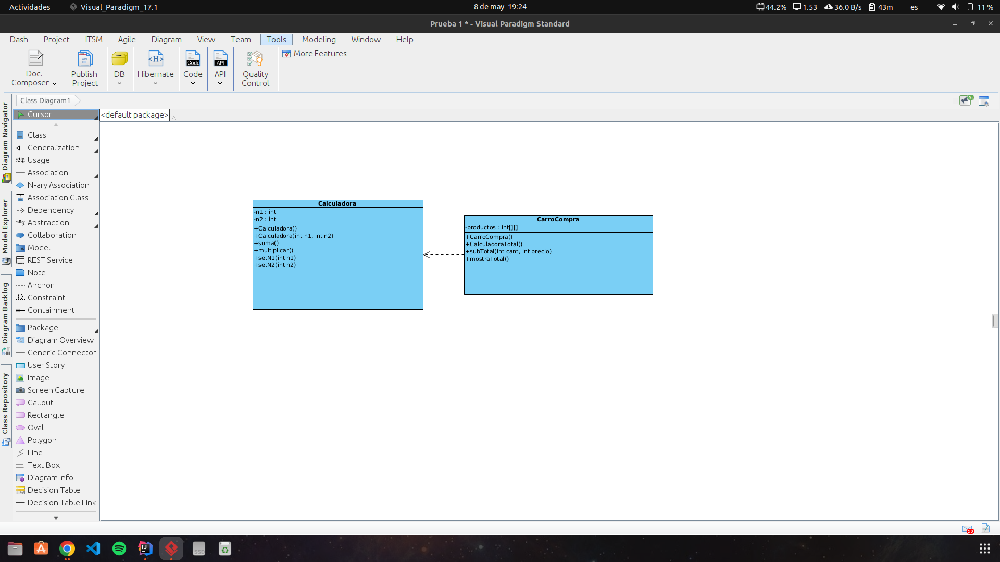

Alumno: Luis Toro Chávez

Evidencia 07:

1. Identificación de las clases y despcrición del contexto problema.
   
        **Clase carroCompra:** Tiene la idea de representar un carro de compras de un sistema de ventas. La forma en la que se 
                                almacenan los datos es mediante una matriz que contiene la cantidades y precios respectivos.
                                Ademas tiene los metodos para calcular el total de compra y mostrarlo en la consola.
        **Clase Calculadora:** Representa los calculos basicos los cuales son la suma, multiplicación, todo se utliza en calculo de 
                                de subtotales.

        En general se trar de un programa de algun local comercial en dodne cuneta con un carro de comprar ademas de calcular el total gastado.

2. Análisis de atributos, métodos y relaciones entre las clases:

        **Clase carroCompra:**
            Atributos:
                - matriz: Matriz que contiene las cantidades y precios de los productos.
            Métodos:
                - calcularTotal: Calcula el total de la compra.
                - mostrarTotal: Muestra el total de la compra en consola.
        
        **Clase Calculadora:**
            Atributos:
                - No posee atributos.
            Métodos:
                - sumar: Realiza la suma de dos números.
                - multiplicar: Realiza la multiplicación de dos números.
3. Representación detallada del código fuente usando un diagrama de clases UML:
        

4. Genere un código Java a partir de su codeladod e clases, de forma automática.

        Codigo generado en el repositorio.
